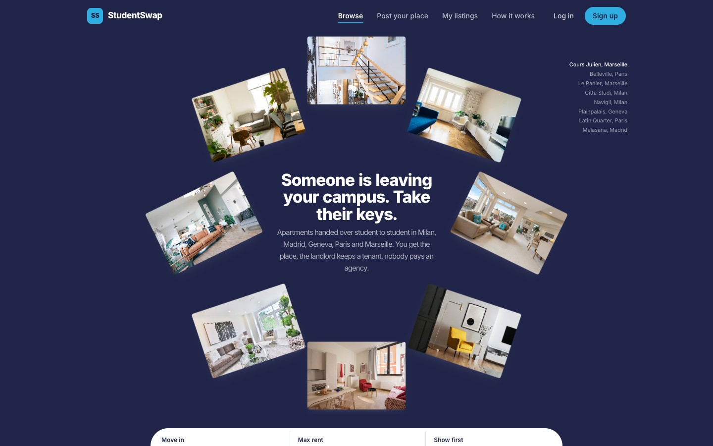
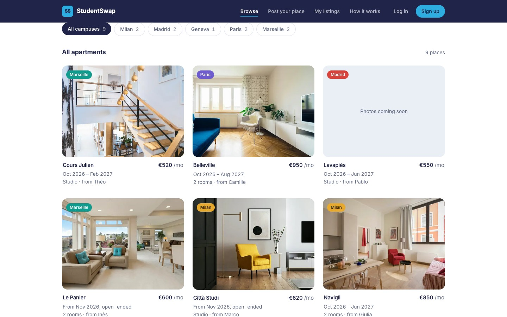
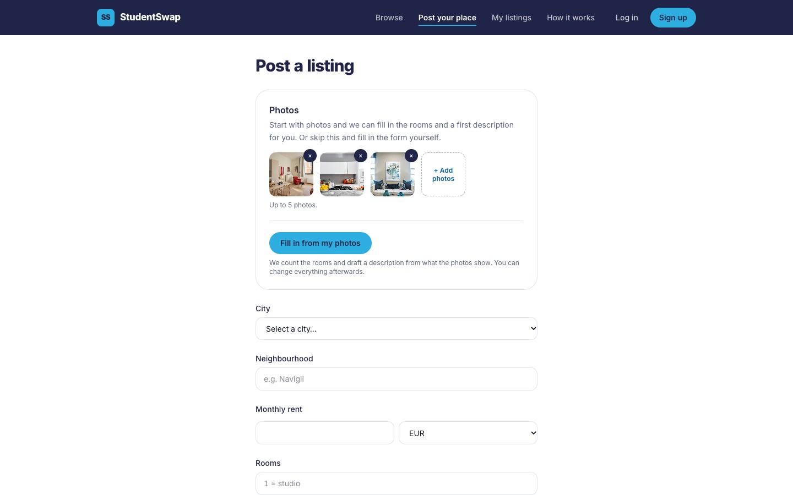
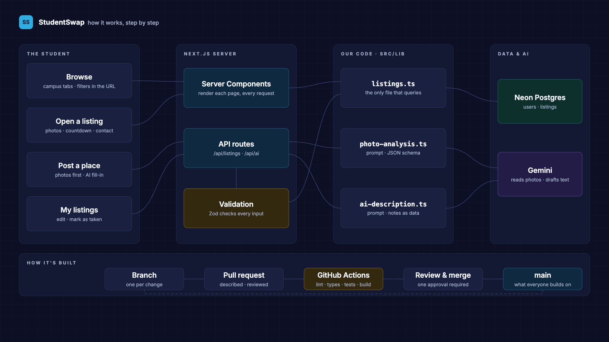
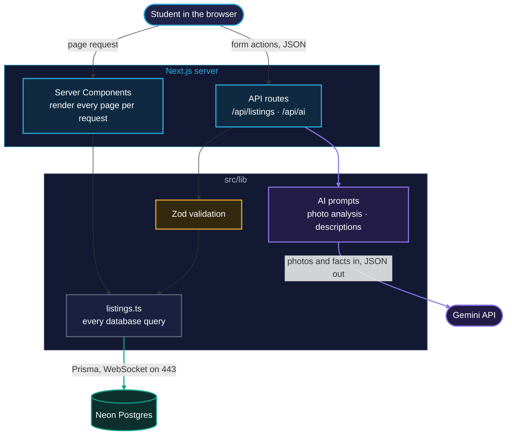

<div align="center">

    

# StudentSwap

**Take over a classmate's apartment when you move campus.**

A marketplace where Albert School students hand their apartment directly to
the student arriving, across Milan, Madrid, Geneva, Paris and Marseille.

[](https://github.com/ASRIDK/student-housing-marketplace/actions/workflows/ci.yml)




</div>

---

[Overview](#overview) ·
[Features](#features) ·
[Tech stack](#tech-stack) ·
[Architecture](#architecture) ·
[Getting started](#getting-started) ·
[Project structure](#project-structure) ·
[AI usage](#ai-usage) ·
[Challenges](#challenges) ·
[Future improvements](#future-improvements) ·
[Team](#team)

## Overview

**The problem.** Albert School students move between five campuses. Every
term, someone leaves a flat in one city while someone else arrives looking
for one — and an agency usually takes a fee in between.

**The idea.** Connect the two directly. The leaving student posts their
apartment, the arriving student takes it over, and the landlord keeps a
tenant without a gap.

StudentSwap was built as the group project of the *Prompt Engineering & Git*
course (Bachelor 2, DAT32-91, Albert School, 2026–27), using AI as a working
tool throughout and Git/GitHub as the team's shared workspace.

## Features

| | |
|---|---|
| **Browse** | Every open apartment across the five campuses, with campus tabs, a move-in date filter, a maximum-rent filter and sorting. Filters live in the URL, so a search can be shared. |
| **Listing page** | Photo gallery, rent, handover dates, a countdown to the day it is free, a share link, and a contact card that emails the current tenant. |
| **Post and edit** | A validated form with a draft that saves itself. Photos come first: **Fill in from my photos** lets AI count the rooms and draft the description, and **Write it for me** drafts the description from the facts. The student always reviews before anything is saved. |
| **My listings** | Your apartments, with editing and a button to mark each one as taken. |
| **API** | JSON endpoints with input validation and consistent errors. |
| **Responsive** | Every page works from phone to desktop. |

<p>


</p>

## Tech stack

| Layer | Technologies |
|---|---|
| **Frontend** | Next.js 16 (App Router), React 19, TypeScript, Tailwind CSS 4 |
| **Backend** | Next.js API routes, Prisma 7, Neon Postgres, Zod |
| **AI** | Google Gemini (photo analysis and description drafting) |
| **Quality** | ESLint, Vitest, GitHub Actions |

## Architecture



Two rules hold the design together: only `src/lib/listings.ts` talks to the
database, and only the server ever holds the AI key.

**See it move.** [`documentation/architecture.html`](documentation/architecture.html)
plays the same diagram step by step from the user's point of view: browsing,
posting with photos, handing a flat over, and how code reaches `main`. Download
it and open it in a browser: Space pauses, the arrow keys step, 1–4 jump to a
chapter, and clicking a block jumps to the step that uses it.

<details>
<summary>The same architecture as a text diagram (Mermaid)</summary>



</details>

## Getting started

**Requirements:** Node.js 22+, a [Neon](https://neon.com) Postgres database
(the free tier is enough) and, for the AI features, a
[Gemini API key](https://aistudio.google.com/apikey).

```bash
git clone https://github.com/ASRIDK/student-housing-marketplace.git
cd student-housing-marketplace
npm install

cp .env.example .env.local   # fill in the values below
npm run db:generate          # generate the Prisma client
npm run db:deploy            # create the tables
npm run db:seed              # load ten sample listings

npm run dev                  # http://localhost:3000
```

| Variable | Value |
|---|---|
| `DATABASE_URL` | Neon **pooled** connection string (host contains `-pooler`) |
| `DATABASE_URL_UNPOOLED` | Neon **direct** connection string, used for migrations |
| `GEMINI_API_KEY` | Optional. Without it the site works and the AI buttons say they are not set up. |

> On networks that block port 5432, the app still works over port 443, but
> `db:deploy` needs 5432: run it once from another network.

**Checks** (run on GitHub for every pull request):

```bash
npm run lint && npm run typecheck && npm test && npm run build
```

### API

Errors are always `{ "error": "..." }`.

| Method | Route | |
|---|---|---|
| `GET` | `/api/listings?city=&maxRent=&availableFrom=&sort=` | Open listings |
| `GET` | `/api/listings/:id` | One listing |
| `POST` | `/api/listings` | Create a listing |
| `PUT` | `/api/listings/:id` | Update a listing (owner only) |
| `PATCH` | `/api/listings/:id/status` | Mark as `active` or `taken` (owner only) |
| `POST` | `/api/ai/analyze-photos` | Photos in, room count and draft description out |
| `POST` | `/api/ai/describe` | Listing facts in, draft description out |

## Project structure

```text
.
├── .github/              CI workflow and code owners
├── assets/screenshots/   Images used in this README
├── documentation/        Challenges, LLM failure modes, design system
├── prisma/               Database schema, migrations and seed script
├── prompts/              Versioned prompt iterations and their evaluation
├── public/campuses/      Campus landmark icons
├── src/
│   ├── app/              Pages and API routes
│   ├── components/       UI components
│   └── lib/              Queries, validation, AI prompts, shared types
└── tasks/                Project briefs and prompt logs
```

## AI usage

AI was used in two ways.

**To build the project.** The team worked with AI coding assistants
(Claude Code and Claude). Every task started from a written brief with a
starter prompt: the stack, the shared data type, one file to build, hard
constraints and a "done when" checklist. Every AI output was built, tested
in the browser and reviewed in a pull request like any other code.

**Inside the product.** Two features call Gemini from the server: reading a
listing's photos to count the rooms and draft a description, and drafting a
description from the form's facts. Both return a suggestion the student
must accept, and both treat user text and text inside photos as data, never
as instructions.

| Where | What it contains |
|---|---|
| [`prompts/`](prompts/) | One prompt followed through four versions, scored on measurable criteria |
| [`tasks/`](tasks/) | The briefs and the prompt logs |
| [`documentation/llm-failure-modes.md`](documentation/llm-failure-modes.md) | Hallucination, sycophancy, prompt injection and context limits, each with a real case from the project |

## Challenges

Full write-ups: [documentation/challenges.md](documentation/challenges.md).

- **The school network blocks Postgres** (port 5432). Solved by connecting
  through Neon's serverless driver over port 443.
- **Main stopped compiling after several merges**, because a conflict was
  resolved in GitHub's web editor. Solved with an integration pass; checks
  now run on every pull request.
- **Libraries newer than the AI's knowledge** (Prisma 7, Zod 4). The
  installed version's error messages were trusted over the suggestions.
- **A 3D component built for artwork**, adapted to apartment photos over
  four prompt iterations.

## Future improvements

- Real accounts (sign-up limited to the school email domain)
- Photo upload and storage
- Deployment with a preview for every pull request
- Messaging between students
- End-to-end tests in CI

**Known limitations today:** login and sign-up are interface only (in
development, the API uses a demo user); listing photos are links rather
than uploads; the site runs locally and is not deployed yet.

## Team

Taoufik ([@ASRIDK](https://github.com/ASRIDK)) ·
Alejandro ([@alejandromirandadefrutos7-sudo](https://github.com/alejandromirandadefrutos7-sudo)) ·
Andrea ([@andrea-callies](https://github.com/andrea-callies)) ·
Leo ([@leovurchio06-gif](https://github.com/leovurchio06-gif)) ·
Côme ([@comedevalk-cyber](https://github.com/comedevalk-cyber))

Albert School, Bachelor 2 Data & AI, 2026–27. Campus icons generated with Gemini.
