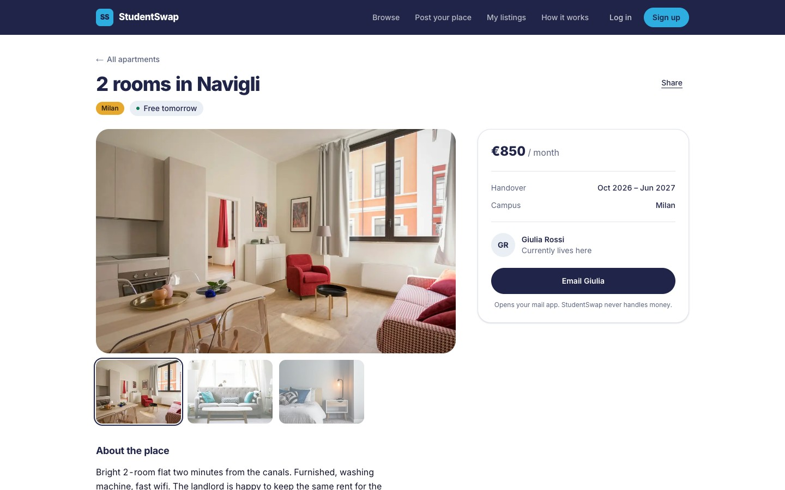
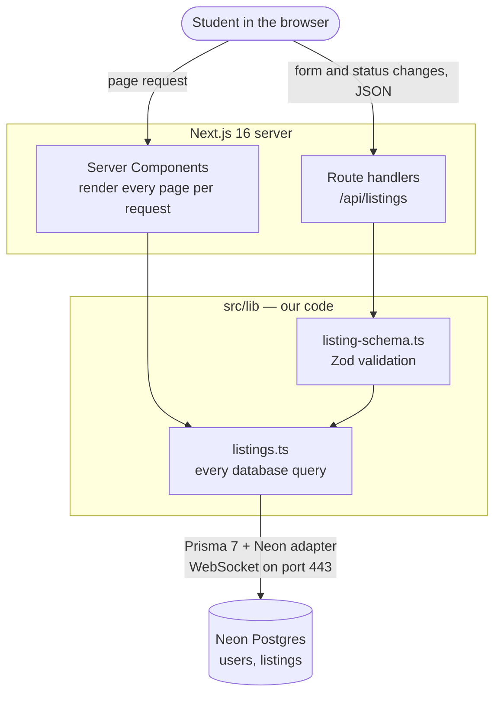

<div align="center">

# StudentSwap

**Take over a classmate's apartment when you move campus.**

A marketplace where Albert School students hand their apartment directly to
the student arriving, in Milan, Madrid, Geneva, Paris and Marseille.

[](https://github.com/ASRIDK/student-housing-marketplace/actions/workflows/ci.yml)


</div>

---

**Contents:**
[Project](#project) ·
[Objective](#objective) ·
[Final result](#final-result) ·
[Tools](#tools) ·
[Getting started](#getting-started) ·
[Project structure](#project-structure) ·
[Architecture](#architecture) ·
[AI usage](#ai-usage) ·
[Main challenges](#main-challenges) ·
[Team](#team) ·
[How we worked](#how-we-worked) ·
[Future improvements](#future-improvements)

## Project

StudentSwap is a web app for one specific moment in a student's life:
leaving a city. Albert School students move between five campuses, so
every term someone leaves a flat in Milan while someone else arrives
looking for one. StudentSwap connects the two directly.

- **Browse** open apartments across the five campuses, filtered by move-in
  date, maximum rent and campus.
- **Open a listing** to see its photos, handover dates and rent, and email
  the student who lives there.
- **Post your own place**, edit it, and mark it as taken once it is handed
  over.

Built for the *Prompt Engineering & Git* course (Bachelor 2, DAT32-91,
Albert School, 2026).

## Objective

Every year the same apartment is let go and found again by a new
student, and an agency often takes a fee in the middle. The two students
involved already exist: one is leaving, the other is arriving. We wanted
to connect them:

- the arriving student gets a place without paying an agency;
- the leaving student hands over the keys without a gap in rent;
- the landlord keeps a tenant.

The second objective was the course's: build a real product as a team
with AI as a working tool, and document how the prompts, the code and the
collaboration evolved.

## Final result

What works today, on real data in a Postgres database:

| | |
|---|---|
| **Home page** | A full-screen 3D wheel of real apartment photos (scroll, drag or use the arrow keys; each card opens its listing), then every open apartment in a photo grid with campus tabs, a move-in date filter, a maximum-rent filter and sorting. |
| **Listing page** | Photo gallery, handover dates, a countdown to when it is free, a share link, and a contact card that emails the current tenant. |
| **Post and edit** | A validated form with a draft that saves itself as you type. Saves through the API. |
| **My listings** | Your apartments, with a button to mark each one taken or open again. |
| **API** | Five JSON endpoints with input validation and consistent errors (see [API](#api)). |
| **Mobile** | Every page works at phone width. |

<p>


</p>

**Not done yet**, stated plainly: there is no real login yet (the login
and sign-up pages are UI only, and in development requests act as a demo
user), photos are links rather than uploads, and the site is not
deployed. See [Future improvements](#future-improvements).

## Tools

| Layer | Technology | Why this one |
|---|---|---|
| Framework | [Next.js 16](https://nextjs.org) (App Router), React 19, TypeScript | Pages and API in one app, one deploy, server rendering |
| Styling | Tailwind CSS 4 | Brand colours as tokens; see [design system](documentation/design-system.md) |
| Database | [Neon](https://neon.com) Postgres | Serverless Postgres with a free tier |
| Data access | Prisma 7 with the Neon adapter | Typed queries and versioned migrations, over port 443 |
| Validation | Zod 4 | One schema guards both the form and the API |
| Quality | ESLint, Vitest, GitHub Actions | Lint, types, tests and build on every pull request |

**AI tools**

| Tool | Used for |
|---|---|
| **Claude Code** (Anthropic) | Main coding assistant in the terminal: writing and reviewing code, integration, debugging, Git |
| **Claude** (claude.ai chat) | Coding help and debugging for the listing page |
| **Claude API** | In the product: the "Write it for me" description button ([PR #15](https://github.com/ASRIDK/student-housing-marketplace/pull/15), in review) |
| **Playwright** | Letting the AI open the site and check screenshots at laptop and phone widths |
| **Neon CLI** | Creating and linking the database from the terminal |

## Getting started

**You need** Node.js 22 or newer and a [Neon](https://neon.com) Postgres
database (the free tier is enough). The app talks to the database through
Neon's serverless driver, so it needs a Neon connection string rather
than a plain local Postgres.

```bash
git clone https://github.com/ASRIDK/student-housing-marketplace.git
cd student-housing-marketplace
npm install

cp .env.example .env.local   # then fill in the two connection strings below
npm run db:generate          # generate the Prisma client
npm run db:deploy            # create the tables
npm run db:seed              # load ten sample listings (safe to re-run)

npm run dev                  # http://localhost:3000
```

In `.env.local`, from your Neon project's **Connect** dialog:

| Variable | Value |
|---|---|
| `DATABASE_URL` | The **pooled** connection string (its host contains `-pooler`). Used by the app. |
| `DATABASE_URL_UNPOOLED` | The **direct** connection string. Used only for migrations. |

> **On a restricted network** (like our school's), port 5432 may be
> blocked. The app and the seed script still work, because they go through
> port 443, but `db:deploy` needs 5432. Run it once from another network.

### Checks

The same four commands run on GitHub for every pull request:

```bash
npm run lint        # ESLint
npm run typecheck   # TypeScript, including Next.js route types
npm test            # unit tests (Vitest)
npm run build       # production build
```

### Other scripts

| Command | What it does |
|---|---|
| `npm run db:migrate` | Create and apply a migration after editing `prisma/schema.prisma` |
| `npm run db:studio` | Browse the database in the browser |

## Project structure

```text
.
├── .github/              CI workflow and code owners
├── assets/screenshots/   Images used in this README
├── documentation/        Challenges, LLM failure modes, design system
├── prisma/               Database schema, migrations and seed script
├── prompts/              Versioned prompt iterations and their evaluation
├── public/               Static files (logo)
├── src/
│   ├── app/              Pages and API routes (Next.js App Router)
│   │   └── api/listings/ The JSON API
│   ├── components/       UI components (ui/ holds the vendored 3D wheel)
│   └── lib/              Database queries, validation, formatting, shared types
└── tasks/                Each member's brief and prompt log
```

## Architecture



**One rule:** only `src/lib/listings.ts` talks to the database. Pages read
through it directly; the form and the dashboard write through the API,
which validates every request first. A schema change touches one file.

### API

Every error is returned as `{ "error": "..." }`.

| Method | Route | |
|---|---|---|
| `GET` | `/api/listings?city=&maxRent=&availableFrom=&sort=` | Open listings. `sort` is `newest`, `cheapest` or `expensive`. |
| `GET` | `/api/listings/:id` | One listing, or 404 |
| `POST` | `/api/listings` | Create a listing. 201 on success. |
| `PUT` | `/api/listings/:id` | Update any of its fields. Owner only. |
| `PATCH` | `/api/listings/:id/status` | `{ "status": "active" \| "taken" }`. Owner only. |
| `POST` | `/api/ai/describe` | Draft a description from the form's facts and optional notes. Logged-in only. |

Until login exists, write requests in development identify the caller with
an `x-user-id` header set to a seeded user (`u-1` to `u-10`). The header
is ignored in production.

## AI usage

AI was part of the **process** for every member, and is becoming part of
the **product**.

**In development.** Each member worked with an AI coding assistant, mostly
Claude Code. The workflow was the same for everyone:

1. **A brief written for the AI.** Each member got a task file in
   [`tasks/`](tasks/) with a ready-made starter prompt: the stack, the
   shared `Listing` type pasted in, one file to build, hard constraints and
   a "done when" checklist. A shared contract file,
   [`00-EVERYONE-READ-THIS-FIRST.txt`](tasks/00-EVERYONE-READ-THIS-FIRST.txt),
   stopped the AI from inventing field names.
2. **The AI writes, the member checks.** Each member built the output,
   checked it in a browser and reviewed it before opening a pull request.
   Work not yet checked stays a draft pull request.
3. **Same rules as human code.** AI-written changes went through the same
   branch, pull request, checks and human merge as everything else.

**In the product.** [PR #15](https://github.com/ASRIDK/student-housing-marketplace/pull/15)
adds a "Write it for me" button that drafts a listing description with
Claude from the facts already in the form, with instructions never to
invent details. It is in review.

**Where to look:**

| | |
|---|---|
| [`prompts/`](prompts/) | One prompt followed through four versions (v1 to v4), with an evaluation table of measurable criteria |
| [`tasks/prompts-*.md`](tasks/) | Each member's prompt log: what they asked, what came back, what went wrong |
| [`documentation/llm-failure-modes.md`](documentation/llm-failure-modes.md) | Hallucination, sycophancy, prompt injection and context limits, each with a case from this project |

The biggest single lesson: **showing the AI a reference beats describing
the result.** Adjectives took several rounds; one screen recording took
one ([v3](prompts/v3_reference_prompt.md)).

## Main challenges

Full write-ups, in *what happened / why / what we tried / what we learned*
form: [documentation/challenges.md](documentation/challenges.md).

- **The school network blocks Postgres.** Port 5432 was closed. We kept the
  database and changed the driver, to Neon's WebSocket connection over
  port 443.
- **`main` stopped compiling after four merges in half an hour.** A
  conflict resolved in GitHub's web editor kept both versions of a file.
  The fix, and the reason CI now builds every pull request.
- **Libraries newer than the AI's knowledge.** Prisma 7 and Zod 4 rejected
  code the assistant suggested for older versions. The installed version
  wins.
- **A 3D component made for artwork.** It turned photos of rooms on their
  side. Four prompt iterations to make it work with photographs.
- **Five people, one data shape.** Two members started before the shared
  skeleton existed; an agreed `Listing` type is what let everyone work in
  parallel.

## Team

| Member | GitHub | Role |
|---|---|---|
| Taoufik | [@ASRIDK](https://github.com/ASRIDK) | Project lead: backend, front-end and integration |
| Alejandro | [@alejandromirandadefrutos7-sudo](https://github.com/alejandromirandadefrutos7-sudo) | Browse page: listing grid, filters, sorting, campus tabs |
| Andrea | [@andrea-callies](https://github.com/andrea-callies) | Site layout: navbar, footer, login and sign-up pages |
| Leo | [@leovurchio06-gif](https://github.com/leovurchio06-gif) | Listing page and "My listings" dashboard |
| Côme | [@comedevalk-cyber](https://github.com/comedevalk-cyber) | Post and edit form, AI description button |

## How we worked

- **One branch per feature** (`feature/…`, `feat/…`, `fix/…`, `docs/…`)
  and one pull request per branch. Apart from the two setup commits on the
  first day, every change reached `main` through a pull request.
- **Conventional commits** (`feat:`, `fix:`, `docs:`, `chore:`), one change
  per commit.
- **Review before merge.** `main` is protected; [`CODEOWNERS`](.github/CODEOWNERS)
  requests a review on every pull request.
- **Checks on every pull request.** Lint, typecheck, tests and a production
  build run in [GitHub Actions](.github/workflows/ci.yml).
- **An integration pass after each round of merges** (PR #7, PR #11) to
  fix what only shows up once features meet: duplicated markup, broken
  imports, a build that needed the internet.

## Future improvements

**Product**

- **Real accounts** with Auth.js, sign-up limited to the school's email
  domain, so a listing truly belongs to the person who posted it.
- **Photo upload** instead of photo links.
- **Deploy** on Vercel, with a preview link on every pull request.
- **Messaging** between students, so the handover happens inside the
  product instead of over email.
- **The AI description button** (PR #15), with the prompt-injection
  hardening described in
  [llm-failure-modes.md](documentation/llm-failure-modes.md#3-prompt-injection).

**Design**, from the AI design review in [prompts/v4](prompts/v4_final_prompt.md):

- one quiet style for the five city badges instead of five loud colours;
- a clear call to action in the hero;
- a shorter blurb so the headline breaks cleanly inside the ring;
- hide the wheel until it has laid itself out, to remove the flash on load.

**Engineering**

- End-to-end tests (Playwright) for the browse, post and mark-as-taken
  flows, run in CI.
- A throwaway Neon database branch for every pull request, so migrations
  are tested before they reach `main`.
